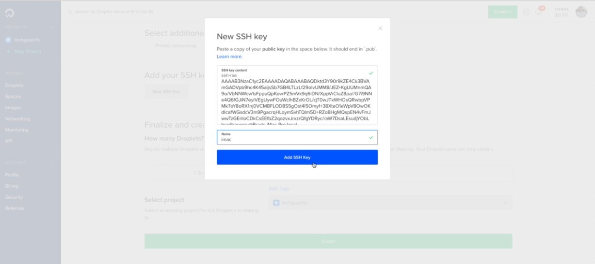

## 05: Apps, URLs & Templates

create new app pages
```
$ python manage.py startapp pages

```

update /btre/btre/settings.py INSTALLED_APPS = []

update /pages/apps.py

create and update /pages/urls.py

update /pages/views.py

update /btre/btre/urls.py

update /btre/btre/settings.py TEMPLATES = [] 

create folder /btre/templates/pages/

create file templates/pages/index.html

create file templates/pages/about.html

update /pages/urls.py for about page

create and update /templates/base.html

create /btre/btre/static/ folder copy the content

update /btre/btre/settings.py STATIC_ROOT

run command for collect static
```
$ python manage.py collectstatic
```

update /btre/.gitignore

install "Better Jinja" vs code extension

locate the template /btre/dist/

update from /dist/index.html to /templates/base.html

create and update /templates/partials/_footer.html

create and update /templates/partials/_navbar.html

create and update /templates/partials/_topbar.html

create new apps listings and realtors
```
$ python manage.py startapp listings
$ python manage.py startapp realtors
```

create and update /templates/listings/listing.html

create and update /templates/listings/listings.html

create and update /templates/listings/search.html

create and update /templates/listings/urls.py

update /btre/urls.py and add listings urls

update /btre/btre/settings.py INSTALLED_APPS = [] for listings and realtors

update /listings/views.py

05 class done and practical done

## 06: Models, Migrations & Admin

https://postgresapp.com/ for Mac PostgreSQL installer

To set the password in new PostgreSQL installation, go to postgresql console -
```
postgres=# \password postgres
Enter new password: 
postgres=# 
postgres=# CREATE DATAGASE btredb OWNER postgres;
postgres=# 
postgres=# \l
postgres=# 
postgres=# \q
```

Install pgadmin 4 in mac

Install Postgres dependencies in django project. In the virtual environment - 
```
$ pip install psycopg2 psycopg2-binary
```

update /btre/settings.py for PostgreSQL db DATABASES = {} 

run migration - 
```
$ python manage.py migrate

```
Django fields reference:

https://docs.djangoproject.com/en/2.2/ref/models/fields/


update listings/models.py Listing model 

update realtors/models.py Realtor model

migrate
```
$ python manage.py makemigrations
$ pip install Pillow
$ python manage.py makemigrations
$ python manage.py migrate
```

creating superuser
```
$ python manage.py help
$ python manage.py createsuperuser
```

> **Staff status** - user can login to admin area or not

update listings/admin.py 

update btre/btre/settings.py MEDIA_URL and MEDIA_ROOT

update btre/btre/urls.py with + static(settings.MEDIA_URL, ....) 

populate data in realtors and listings from html template. <----------- 1

create and update /templates/admin/base_site.html

create and update /btre/btre/static/css/admin.css  

update /listings/admin.py for admin custom list view (ListingAdmin)

update /realtors/admin.py for admin custom list view (RealtorAdmin)

06: class done and practical not done

## 07: View Methods, Display & Search

VS code may not recognize django methods and show error. Install in the VM -
```
$ pip install pylint-django
```

And, add to the .vscode/settings.json
```
{"python.linting.pylintArgs": [
     "--load-plugins=pylint_django"
],}
```

update /listings/views.py index method 

update /templates/listings/listings.html

update /btre/btre/settings.py INSTALLED_APPS -> .humanize

django pagination https://docs.djangoproject.com/en/2.2/topics/pagination/

update /pages/views.py

update /templates/pages/index.html

update /templates/pages/about.html

update /templates/listings/listing.html

update /listings/views.py -> listing()

create and update /listings/choices.py

update /pages/views.py with choices

update /templates/pages/index.html search fields

update /templates/listings/search.html

update /listings/views.py import choices

update /listings/views.py search()

07: class done and practical done

## 08: Accounts & Authentication

Create new app accounts
```
$ python manage.py startapp accounts
```

create and update /accounts/urls.py

update /btre/btre/settings.py INSTALLED_APP

update /btre/btre/urls.py 

create and update /templates/login.html

create and update /templates/register.html

create and update /templates/dashboard.html

update /accounts/views.py 

update /templates/partials/_navbar.html register and login

django messaging app - https://docs.djangoproject.com/en/2.2/ref/contrib/messages/

update /btre/btre/settings.py

create and update /templates/partials/_alerts.html

update /templates/accounts/register.html include alert()

create and update /btre/btre/static/js/main.js

```
$ python manage.py collectstatic
$ 
```

update /pages/index.html

update /templates/accounts/dashboard.html

update /partials/_navbar.html

update /accounts/views.py

update /templates/base.html title

update /pages/index.html block title

update /templates/listings/listings.html block title

update /templates/listings/search.html block title

update /templates/listings/listing.html block title

update /templates/accounts/register.html block title

update /templates/accounts/login.html block title

update /templates/accounts/dashboard.html block title

08: class done and practical done

## 09: Contact Inquiries

```
$ python manage.py startapp contacts

```

update /contacts/models.py

```
$ python manage.py migrate
```

check in pgadmin contacts table

update contacts/admin.py

login in admin and check if contacts is created

update /templates/listings/listing.html form action

create and update /contacts/urls.py

update /btre/btre/urls.py

update /contacts/views.py

check from "Make An Inquiry" if Name and Email is loading for logged in user

Sending email: https://docs.djangoproject.com/en/2.2/topics/email/ 

update /btre/settings.py # email config

update /accounts/dashboard.html

09: class done and practical done

## 10. Django Deployment

Create a git repo in github as private. 

Create a **.gitignore** in the the project folder.

```
$ cat .gitignore

# ------------------

*.log
*.pot
*.pyc
__pycache__/
local_settings.py
db.sqlite3
/media
venv
/static

```

Now run ```git add .``` , ```git commit -m "work summery"``` and ```git push -u origin master```

Django Deployment to Ubuntu 18.04: https://gist.github.com/bradtraversy/cfa565b879ff1458dba08f423cb01d71

Go to the home directory to setup SSH - 
```
$ cd ~
$ ls -la
...
.ssh
...
$ ls ./.ssh
$ ssh-keygen
Enter file in which to save the key: /users/shahjalalh/.ssh/id_rsa_do
Enter passphrase:
Enter same passphrase again:
....
$ cat ./.ssh/id_rsa_do.pug

```
copy the text and paste to Digital Ocean SSH key -


Login from terminal with ssh:
```
$ ssh root@digital.ocean.server.ip

# if : Permission denied (publickey)
# if your renamed the public key it may show

$ ssh-add ./.ssh/id_rsa_do
$ ssh root@digital.ocean.server.ip
$ 
```

Adding new user and stop root login in the droplet:
```
root@ubuntu1:~# adduser djangoadmin
root@ubuntu1:~# usermod -aG sudo djangoadmin
root@ubuntu1:~# exit

$ ssh djangoadmin@digital.ocean.server.ip 
...
Permission denied
# this is because the ssh is added is for root user
```

Log back in root:
```
$ ssh root@digital.ocean.server.ip
root@ubuntu1:~# cd /home/djangoadmin
root@ubuntu1:~# mkdir .ssh
root@ubuntu1:~# ls -a
root@ubuntu1:~# cd .ssh
root@ubuntu1:~# nano authorized_keys
root@ubuntu1:~# 
```

Copy the rsa content into authorized_keys
In the local terminal -
```
$ cat ./.ssh/id_rsa_do.pub

# the the cloud VPS
root@ubuntu1:~# nano authorized_keys
# and paste text

root@ubuntu1:~# cat authorized_keys
root@ubuntu1:~# exit
```

Now SSH with djangoadmin
```
$ ssh djangoadmin@digital.ocean.server.ip 
```

Now stop the ```root``` login:
```
$ sudo nano /etc/ssh/sshd_config

...
PermitRootLogin no
PasswordAuthentication no
...
```

**Reload ```sshd``` service**
```
root@ubuntu1:~# sudo systemctl reload sshd
```

**References:**
- https://www.digitalocean.com/community/tutorials/how-to-set-up-django-with-postgres-nginx-and-gunicorn-on-ubuntu-16-04

- https://www.digitalocean.com/community/tutorials/how-to-set-up-django-with-postgres-nginx-and-gunicorn-on-ubuntu-18-04

- https://www.digitalocean.com/community/tutorials/how-to-serve-django-applications-with-uwsgi-and-nginx-on-debian-8

- https://www.digitalocean.com/community/tutorials/how-to-set-up-django-with-postgres-nginx-and-gunicorn-on-debian-9


**Simple Firewall Setup:**

```
$ sudo ufw app list
$ sudo ufw allow OpenSSH
$ sudo ufw enable
$ sudo ufw status
$  
```

Login to remote droplet as djangoadmin:
```
$ sudo apt update
$ sudo apt upgrade
$ sudo apt install python3-pip python3-dev libpq-dev postgresql postgresql-contrib nginx curl
$ 
``` 

**PostgreSQL Database & User Setup**
```
$ sudo -u postgres psql
# CREATE DATABASE btre_prod;
# CREATE USER dbadmin WITH PASSWORD 'abc123!';
# ALTER ROLE dbadmin SET client_encoding TO 'utf8';
# ALTER ROLE dbadmin SET default_transaction_isolation TO 'read committed';
# ALTER ROLE dbadmin SET timezone TO 'UTC';
# GRANT ALL PRIVILEGES ON DATABASE btre_prod TO dbadmin;
# \q
```

10: 05
